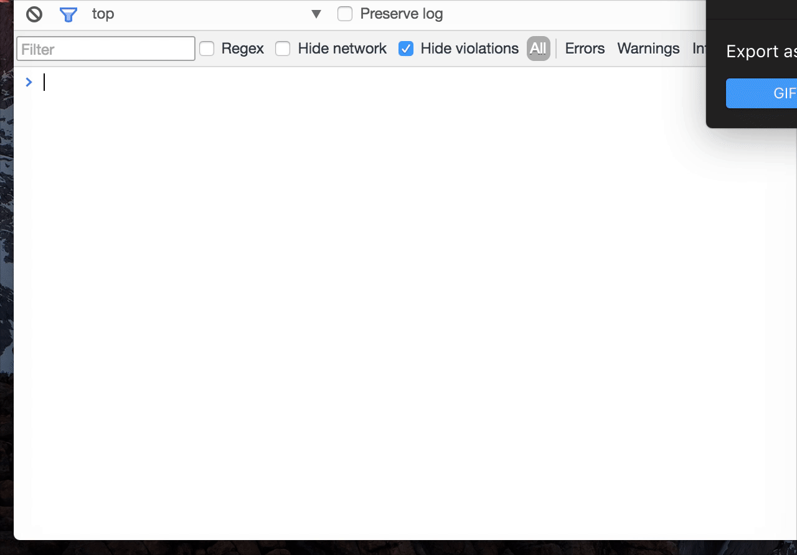

# Console Importer

[](https://travis-ci.org/pd4d10/console-importer)
[](https://codecov.io/gh/pd4d10/console-importer)
[](https://chrome.google.com/webstore/detail/console-importer/hgajpakhafplebkdljleajgbpdmplhie)
[](https://chrome.google.com/webstore/detail/console-importer/hgajpakhafplebkdljleajgbpdmplhie)
[](https://chrome.google.com/webstore/detail/console-importer/hgajpakhafplebkdljleajgbpdmplhie)



## Installation

Install it from Chrome Web Store:

https://chrome.google.com/webstore/detail/console-importer/hgajpakhafplebkdljleajgbpdmplhie

## Usage

Open Chrome devtools console, a function named `$i` could be used to import JavaScript and CSS resources.

```js
$i('jquery')
```

Import specific version:

```js
$i('jquery@2')
```

Also, you can import a valid script URL:

```js
$i('https://cdnjs.cloudflare.com/ajax/libs/jquery/3.1.1/jquery.min.js')
```

CSS is supported, too:

```js
$i('https://maxcdn.bootstrapcdn.com/bootstrap/3.3.7/css/bootstrap.min.css')
```

## Trouble shooting

### Q: `$i` doesn't work as expected

Some websites like Google Inbox already have `$i` used as a global variable. This extension doesn't overwrite it.

You can use `console.$i` on these websites.

### Q: `$i` fail to import resources

On some websites like GitHub, `$i` will fail to import resources. Console warning may be like follows:

```js
Refused to load the stylesheet 'https://maxcdn.bootstrapcdn.com/bootstrap/3.3.7/css/bootstrap.min.css' because it violates the following Content Security Policy directive: "style-src 'unsafe-inline' assets-cdn.github.com".
```

It is because of strict Content Security Policy of these websites. For more information, see [Content Security Policy (CSP) wiki](https://developer.mozilla.org/en-US/docs/Web/HTTP/CSP)

## How does it work?

* If it is like a JavaScript lib name, like `jquery`, try to load it from cdnjs
* If it has version number, like `jquery@2`, try to load it from unpkg
* If it is a valid URL(CSS or JS), load it directly

For advanced use, there are also two functions `$i.unpkg` and `$i.cdnjs` which could be used to import resources from specific CDN.

## License

MIT
