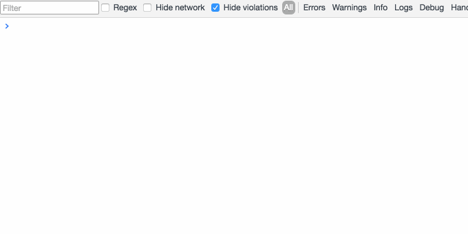
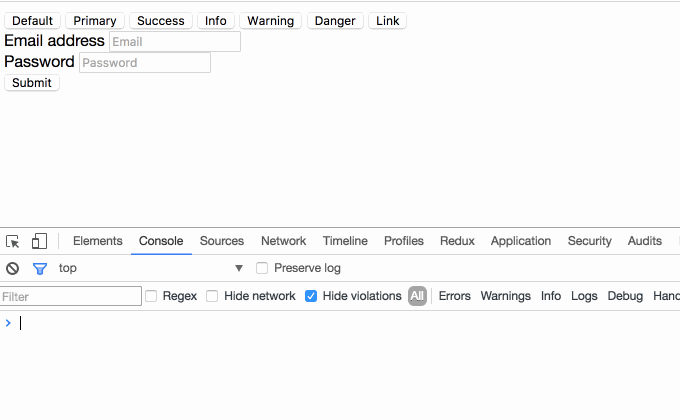

# Console Importer

Import JavaScript and CSS resources from console, with one command.



## Installation

Install it from [Chrome Web Store]()

## Usage

Open Chrome devtools console, a function named `$i` could be used to import JavaScript and CSS resources.

```js
$i('jquery')
```

Import specific version:

```js
$i('jquery@2')
```

Also, you can import a valid script URL:

```js
$i('https://cdnjs.cloudflare.com/ajax/libs/jquery/3.1.1/jquery.min.js')
```

CSS is supported, too:

```js
$i('https://maxcdn.bootstrapcdn.com/bootstrap/3.3.7/css/bootstrap.min.css')
```



**Notice** that on some website like GitHub, `$i` will fail to import resources, warning like follows:

```js
Refused to load the stylesheet 'https://maxcdn.bootstrapcdn.com/bootstrap/3.3.7/css/bootstrap.min.css' because it violates the following Content Security Policy directive: "style-src 'unsafe-inline' assets-cdn.github.com".
```

It is because of these websites' strict Content Security Policy.

For more information, see [Content Security Policy (CSP) wiki](https://developer.mozilla.org/en-US/docs/Web/HTTP/CSP)

## How does it work?

1. If argument passed is a valid URL, load it directly
2. If argument has version like `jquery@2`, try to load it from unpkg
3. Else, try to load it from cdnjs

Step 2 and 3 are also available as `$i.unpkg` or `$i.cdnjs`. If you are certain about which CDN to use, these are better choices.

## License

MIT
